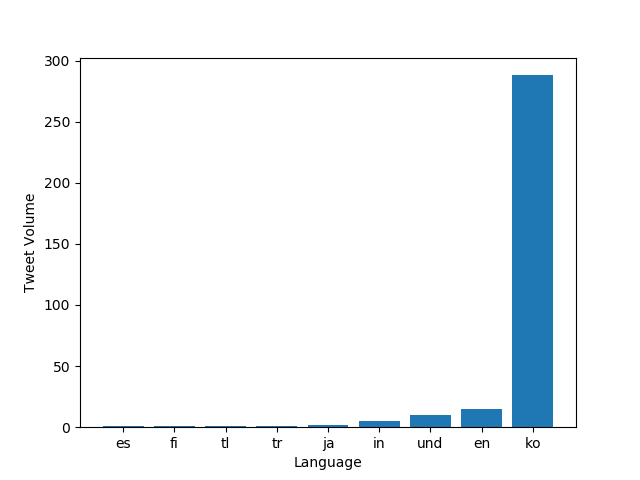

# Twitter Dataset Analysis

For this project, I used the mapreduce method and the matplotlib library to generate graphs illustrating the use of various hashtags related to the coronavirus for the year 2020.
The `map.py` file processes a zip file for an individual day of tweets and tracks the usage of the hashtags on both a language and country level.
The output of running `map.py` is two files, one that ends in `.lang` for hashtag usage by language and one that ends in `.country` for hashtag use by country.
The `run_maps.sh` file loops over each file in the dataset and runs the `map.py` command on that file.
The `reduce.py` file merges the outputs generated by the `map.py` file so that the combined files can be visualized.
The `visualize.py` file takes `--input_path` and `--key` as inputs and generates a bar graph of the the top 10 languages/countries (depending on the `--input_path`) that used the hashtag specified by `--key` and stores the bar graph as a png file.
For example, the graphs below show the top 10 languages and countries for the uses of the hashtags `#coronavirus` and `#코로나바이러스`. 

By running the command 
```
python3 ./src/visualize.py --input_path=reduced.lang --key='#coronavirus'
```
We get

## Use of #coronavirus in 2020 by Language


By running the command
```
python3 ./src/visualize.py --input_path=reduced.country --key='#coronavirus'
```
We get

## Use of #coronavirus in 2020 by Country


By running the command
```
python3 ./src/visualize.py --input_path=reduced.lang --key='#코로나바이러스'
```
We get

## Use of #코로나바이러 in 2020 by Language



By running the command
```
python3 ./src/visualize.py --input_path=reduced.country --key='#코로나바이러스'
```
We get

## Use of #코로나바이러 in 2020 by Country


The `alternative_reduce.py` file takes several `--keys` as inputs and outputs a line graph of the use of each key (in tweet volume) throughout the year.

By running the command
```
python3 ./src/alternative_reduce.py --keys '#doctor' '#nurse'
```
We get 
## Use of #doctor and #nurse Throughout 2020


By running the command
```
python3 ./src/alternative_reduce.py --keys '#doctor' '#nurse'
```
We get
## Use of #doctor and #nurse Throughout 2020


